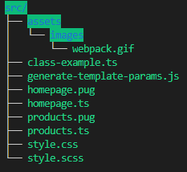
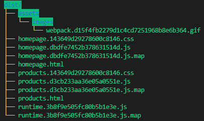

# Boilerplate for webpack4 + pug.js + scss + typescript
This configuration is easy to understand and to modify. Fitted to build multiple html pages website thanks to :
- webpack v4
- pug.js (templating engine)
- scss (css preprocessor)
- typescript

## NPM scripts
- `npm run start` - run the dev server on localhost:8080
- `npm run build:prod` - production build (with optimization and minimization)
- `npm run build:dev` - development build

| input | output |
|-------|--------|
|  |  |

## Template locals injection

You have to generate locals before the compilation.
This generation is mocked in [generate-template-params.js](./src/generate-template-params.js). 

```js
new HtmlWebpackPlugin({
    template: './src/homepage.pug',
    filename: 'homepage.html',
    templateParameters: require('../src/generate-template-params.js'),
    ...
}),
```

Note that you also write the locals as :
```js
new HtmlWebpackPlugin({
    template: './src/homepage.pug',
    filename: 'homepage.html',
    templateParameters: {
        myTitle: 'this is the title value !'
    },
    ...
}),
```

## I want a page to be static (no scripts)
In the corresponding `HtmlWebpackPlugin`, set `inject` to false.

## .ts files are being parsed but they are not imported in the webpack bundle
This is the default behavior of `ts-loader`. It respects the `include`, `files`, and `exclude` options in your `tsconfig.json`. You can force the loader to parse only imported files by setting `onlyCompileBundledFiles` to false.  
More on https://github.com/TypeStrong/ts-loader#onlycompilebundledfiles-boolean-defaultfalse.
